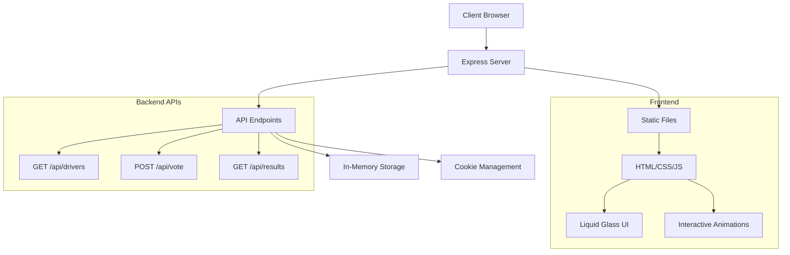

# 🏎️ Formula 1 Fan Hub

<div align="center">


**A modern, interactive Formula 1 fan application with real-time voting and official 2025 season data**

[](https://www.docker.com/)
[](https://nodejs.org/)
[](https://expressjs.com/)
[](https://developer.mozilla.org/en-US/docs/Web/JavaScript)

[](https://opensource.org/licenses/MIT)
[](http://makeapullrequest.com)
[](https://github.com/yourusername/f1-fan-app/stargazers)

</div>

---

## 🌟 Features

<table>
<tr>
<td width="50%">

### 🏁 **Official 2025 F1 Data**
- All 20 current F1 drivers
- Official team lineups and changes
- Driver numbers and countries
- High-quality driver photos

### 🎨 **Formula1.com-Inspired Design**
- Official F1 red color scheme
- Modern card-based layouts
- Professional typography
- Responsive design for all devices

</td>
<td width="50%">

### 💎 **Liquid Glass Effects**
- iOS-inspired frosted glass elements
- Backdrop blur filters
- Translucent panels with depth
- Modern visual hierarchy

### 🗳️ **Interactive Voting System**
- Vote for next GP winner
- One vote per user (cookie-based)
- Real-time results with animations
- Live vote tallies and percentages

</td>
</tr>
</table>

---

## 🚀 Quick Start

### Option 1: One-Click Setup (Recommended)

```bash
# Clone the repository
git clone https://github.com/yourusername/f1-fan-app.git
cd f1-fan-app

# Run the setup script
chmod +x setup.sh
./setup.sh
```

### Option 2: Manual Setup

```bash
# Clone the repository
git clone https://github.com/yourusername/f1-fan-app.git
cd f1-fan-app

# Start with Docker Compose
docker compose up --build -d

# Open your browser
open http://localhost:3000
```

### Option 3: Multi-Platform Build

```bash
# Build for multiple architectures
docker buildx build --platform linux/amd64,linux/arm64 -t f1fanapp .

# Run the container
docker run -p 3000:3000 f1fanapp
```

---

## 📸 Screenshots

<div align="center">

### 🏎️ Drivers Page
*Browse all 20 F1 drivers with official photos and team information*


### 🗳️ Voting Interface
*Interactive voting system with modern glass effects*


### 📊 Live Results
*Real-time vote tallies with animated charts and podium effects*


</div>

---

## 🏁 2025 F1 Season Lineup

<div align="center">

| Team | Driver 1 | Driver 2 | Status |
|------|----------|----------|---------|
| 🔴 **Red Bull Racing** | Max Verstappen (#1) | Sergio Pérez (#11) | - |
| 🔴 **Ferrari** | **Lewis Hamilton (#44)** | Charles Leclerc (#16) | ⭐ Team Change |
| 🩶 **Mercedes** | George Russell (#63) | **Kimi Antonelli (#12)** | 🆕 Rookie |
| 🧡 **McLaren** | Lando Norris (#4) | Oscar Piastri (#81) | - |
| 💚 **Aston Martin** | Fernando Alonso (#14) | Lance Stroll (#18) | - |
| 💙 **Alpine** | Pierre Gasly (#10) | **Jack Doohan (#7)** | 🆕 Rookie |
| 💚 **Kick Sauber** | Nico Hülkenberg (#27) | **Gabriel Bortoleto (#5)** | 🆕 Rookie |
| 💙 **RB** | Yuki Tsunoda (#22) | **Isack Hadjar (#6)** | 🆕 Rookie |
| 💙 **Williams** | Alexander Albon (#23) | **Carlos Sainz (#55)** | ⭐ Team Change |
| 🤍 **Haas** | **Esteban Ocon (#31)** | **Oliver Bearman (#87)** | ⭐🆕 New Lineup |

*⭐ = Team change for 2025 | 🆕 = Rookie driver*

</div>

---

## 🛠️ Technology Stack

<div align="center">

### Backend


### Frontend


### DevOps


</div>

---

## 🏗️ Architecture



---

## 📋 Prerequisites

- **Docker** (recommended) or **Node.js 18+**
- **Git** for cloning the repository
- **Modern web browser** with JavaScript enabled

---

## 🔧 Development Setup

### Local Development

```bash
# Install dependencies
npm install

# Start development server
npm run dev

# Access the app
open http://localhost:3000
```

### Environment Variables

```bash
# Optional environment variables
PORT=3000                    # Server port (default: 3000)
NODE_ENV=production         # Environment mode
```

---

## 🐳 Docker Configuration

### Dockerfile Features
- ✅ **Multi-platform support** (ARM64 & x64)
- ✅ **Security hardened** with non-root user
- ✅ **Health checks** for monitoring
- ✅ **Optimized layers** for faster builds
- ✅ **Alpine Linux** base for smaller images

### Docker Compose Features
- ✅ **Single command deployment**
- ✅ **Automatic restart policies**
- ✅ **Network isolation**
- ✅ **Health monitoring**

---

## 📊 API Documentation

### Endpoints

| Method | Endpoint | Description | Response |
|--------|----------|-------------|----------|
| `GET` | `/api/drivers` | Get all F1 drivers | Driver list with photos |
| `POST` | `/api/vote` | Submit vote for driver | Vote confirmation |
| `GET` | `/api/results` | Get live vote results | Vote statistics |

### Example Responses

<details>
<summary><strong>GET /api/drivers</strong></summary>

```json
{
  "success": true,
  "data": [
    {
      "id": 1,
      "name": "Max Verstappen",
      "team": "Red Bull Racing Honda RBPT",
      "number": 1,
      "country": "Netherlands",
      "imageUrl": "https://www.formula1.com/..."
    }
  ]
}
```
</details>

<details>
<summary><strong>POST /api/vote</strong></summary>

```json
{
  "success": true,
  "message": "Vote recorded for Max Verstappen!",
  "data": {
    "driverId": 1,
    "driverName": "Max Verstappen"
  }
}
```
</details>

<details>
<summary><strong>GET /api/results</strong></summary>

```json
{
  "success": true,
  "data": {
    "results": [
      {
        "id": 1,
        "name": "Max Verstappen",
        "team": "Red Bull Racing Honda RBPT",
        "votes": 15
      }
    ],
    "totalVotes": 50,
    "lastUpdated": "2025-01-15T10:30:00.000Z"
  }
}
```
</details>

---

## 🎨 Design Features

### Formula1.com-Inspired Styling
- **Official F1 Red (#e50000)** primary color
- **Modern typography** with Inter font family
- **Card-based layouts** matching F1.com aesthetics
- **Professional gradients** and shadow effects

### Liquid Glass Effects
- **Backdrop blur filters** for depth and modern feel
- **Translucent backgrounds** with subtle opacity
- **Layered glass panels** for enhanced visual hierarchy
- **iOS-inspired frosted glass** navigation elements

### Interactive Animations
- **Staggered card animations** on page load
- **3D hover effects** with perspective transforms
- **Smooth page transitions** with fade effects
- **Progress bar animations** with shimmer effects
- **Number counting animations** for vote tallies

---

## 🚀 Deployment

### Production Deployment

```bash
# Build production image
docker build -t f1fanapp .

# Run with environment variables
docker run -p 3000:3000 -e NODE_ENV=production f1fanapp
```

### Multi-Platform Build

```bash
# Create buildx builder
docker buildx create --name multiarch --use

# Build for multiple platforms
docker buildx build --platform linux/amd64,linux/arm64 -t f1fanapp --push .
```

---

## 🤝 Contributing

We welcome contributions! Please see our [Contributing Guidelines](CONTRIBUTING.md) for details.

### Development Workflow

1. **Fork** the repository
2. **Create** a feature branch (`git checkout -b feature/amazing-feature`)
3. **Commit** your changes (`git commit -m 'Add amazing feature'`)
4. **Push** to the branch (`git push origin feature/amazing-feature`)
5. **Open** a Pull Request

---

## 📝 License

This project is licensed under the **MIT License** - see the [LICENSE](LICENSE) file for details.

---

## 🙏 Acknowledgments

- **Formula 1** for official driver data and inspiration
- **Formula1.com** for design inspiration
- **F1 Community** for feedback and support
- **Docker** for containerization platform
- **Node.js** and **Express** communities

---

## 📞 Support

<div align="center">

**Having issues? We're here to help!**

[](https://github.com/yourusername/f1-fan-app/issues)
[](https://github.com/yourusername/f1-fan-app/discussions)

**⭐ If you like this project, please give it a star on GitHub! ⭐**

</div>

---

<div align="center">

**Made with ❤️ for the F1 Community**


*Experience the thrill of Formula 1 with modern web technology*

</div>
